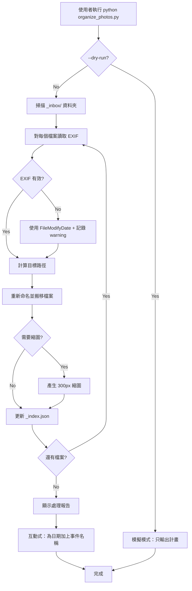

# Sony A6400 Photo Organization Tool

一個可重複使用的 Python 工具，用於整理 Sony A6400 相機的照片和影片。

## User Review Required

> [!IMPORTANT]
> **依賴項目**：需要安裝 `exiftool` (透過 Homebrew) 和 Python packages (`Pillow`, `tqdm`)

> [!WARNING]  
> **破壞性操作**：程式會搬移檔案。建議先用 `--dry-run` 確認結果。

---

## 功能概覽

| 功能 | 說明 |
|------|------|
| 自動讀取 EXIF | 從照片/影片取得拍攝時間 |
| 智慧重新命名 | `A6401534.JPG` → `20250226_074104_A6401534.JPG` |
| 按日期歸檔 | 自動建立 `YYYY/MM/YYYY-MM-DD/photos/` 結構 |
| 縮圖產生 | 產生 300px 寬的縮圖供快速瀏覽或 AI 分析（僅照片） |
| JSON 索引 | 產生 `_index.json` 供 AI 查詢 |
| 進度顯示 | 使用 `tqdm` 顯示處理進度 |
| 完整 Log | 所有操作記錄到 `organize.log` |
| 互動式事件命名 | 處理完後可選擇為特定日期加上事件名稱 |
| Sidecar 處理 | 影片的 XML sidecar 會一起搬移 |

---

## Proposed Changes

### Core Module

#### [NEW] [organize_photos.py](file:///Volumes/Crucial%20X6/A6400/organize_photos.py)

主程式，包含以下功能：

```python
# 命令列參數
--input       # 輸入資料夾，預設 _inbox/
--output      # 輸出根目錄，預設當前目錄
--dry-run     # 模擬執行，不實際搬移
--no-thumbnail # 跳過縮圖產生
--verbose     # 詳細輸出
```

**模組結構：**

```
organize_photos.py
├── class PhotoOrganizer
│   ├── scan_files()          # 掃描輸入資料夾
│   ├── read_exif()           # 讀取 EXIF metadata
│   ├── generate_new_path()   # 計算目標路徑和新檔名
│   ├── move_file()           # 搬移檔案
│   ├── generate_thumbnail()  # 產生縮圖
│   └── update_index()        # 更新 _index.json
│
├── class ProgressLogger
│   ├── log_info()            # 一般資訊
│   ├── log_warning()         # 警告（例如 EXIF 缺失）
│   ├── log_error()           # 錯誤
│   └── generate_report()     # 產生最終報告
│
└── main()
    ├── parse_args()
    ├── run_organization()
    └── interactive_event_naming()
```

---

### 輸出結構

#### [NEW] `_inbox/` 資料夾

你從記憶卡複製檔案的地方。程式會掃描這裡。

#### [NEW] `_index.json`

```json
{
  "last_updated": "2026-01-03T11:15:00+08:00",
  "total_photos": 3704,
  "total_videos": 35,
  "files": [
    {
      "original_name": "A6401534.JPG",
      "new_name": "20250226_074104_A6401534.JPG",
      "path": "2025/02/2025-02-26/photos/20250226_074104_A6401534.JPG",
      "thumbnail": "2025/02/2025-02-26/thumbnails/20250226_074104_A6401534_thumb.jpg",
      "datetime": "2025-02-26T07:41:04",
      "type": "photo",
      "size_bytes": 5242880,
      "camera": "SONY ILCE-6400"
    }
  ],
  "events": {
    "2024-12-27": "京都旅行"
  }
}
```

#### [NEW] `organize.log`

```
2026-01-03 11:15:00 [INFO] Starting organization...
2026-01-03 11:15:00 [INFO] Found 1578 files in DCIM-cardA
2026-01-03 11:15:00 [INFO] Found 2126 files in DCIM-cardB
2026-01-03 11:15:01 [INFO] Processing A6401534.JPG -> 2025/02/2025-02-26/photos/
2026-01-03 11:15:01 [WARNING] C0005.MP4 missing DateTimeOriginal, using FileModifyDate
2026-01-03 11:20:00 [INFO] Complete. 3704 photos, 35 videos processed.
```

---

## 處理流程



---

## 錯誤處理策略

| 情境 | 處理方式 |
|------|----------|
| EXIF 無 DateTimeOriginal | 使用 FileModifyDate，記錄 warning |
| 檔案搬移失敗 | 跳過該檔案，記錄 error，繼續處理其他 |
| 縮圖產生失敗 | 跳過縮圖，記錄 warning，繼續處理 |
| 檔名衝突 | 加上 `_1`, `_2` 後綴 |
| 程式中斷 | 可重新執行，會跳過已處理的檔案 |
| 影片 sidecar 缺失 | 只搬移 MP4，記錄 warning |

---

## 已知限制（Scope 邊界）

> [!NOTE]
> 以下功能**不在**此版本範圍內，避免過度開發：

| 不做的事 | 原因 |
|----------|------|
| 自動偵測事件邊界 | 太複雜，手動標記更可靠 |
| 人臉辨識/場景分類 | 需要額外 ML 模型，之後再加 |
| 雲端自動同步 | 你手動上傳 Google Drive 即可 |
| RAW 檔處理 | 你目前只拍 JPG |
| 影片縮圖/預覽 | 需要 ffmpeg，之後再加 |
| AVCHD 格式處理 | 目前只處理 MP4 (XAVC-S) |

---

## 依賴項目

```bash
# 系統依賴
brew install exiftool

# Python 依賴
pip install Pillow tqdm
```

---

## 使用方式

```bash
# 1. 從記憶卡複製檔案到 _inbox/
cp -r /Volumes/SDCARD/DCIM/100MSDCF/* /Volumes/Crucial\ X6/A6400/_inbox/

# 2. 先執行 dry-run 確認結果
python organize_photos.py --dry-run

# 3. 確認沒問題後正式執行
python organize_photos.py

# 4. 互動式為日期加上事件名稱（可選）
# 程式會問你：
#   2024-12-27 (15張) 事件名稱？[Enter 跳過]: 京都旅行
```

---

## Verification Plan

### Dry-Run 測試

```bash
python organize_photos.py --dry-run --input DCIM-cardA/100MSDCF --verbose
```

預期輸出：
- 顯示會處理的檔案數量
- 顯示每個檔案會被重新命名成什麼
- 顯示會建立哪些資料夾
- 不實際搬移任何檔案

### 小批次測試

先用 10 張照片測試完整流程：
```bash
mkdir _inbox_test
cp DCIM-cardA/100MSDCF/A640153{4,5,6,7,8,9}.JPG _inbox_test/
python organize_photos.py --input _inbox_test
```

確認：
- [x] 檔案正確重新命名
- [x] 資料夾結構正確
- [x] 縮圖產生成功
- [x] `_index.json` 內容正確
- [x] `organize.log` 記錄完整
